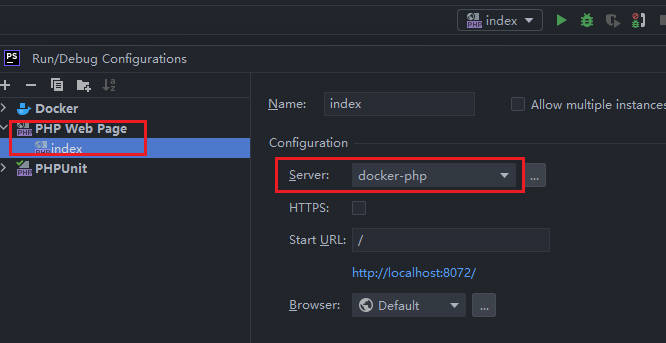
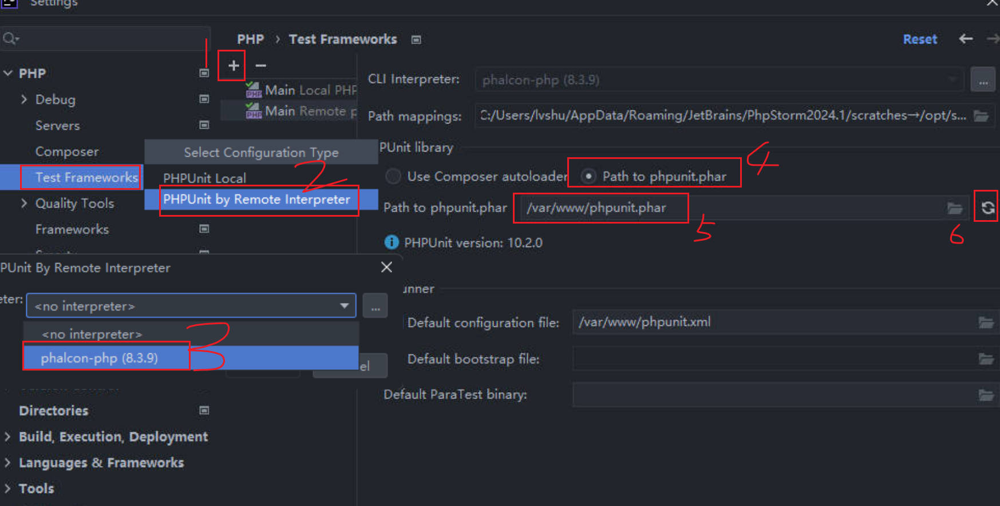

# Phalcon Test

phpunit test for phalcon project

## step

1. `docker-compose up -d` 启动服务
2. `cd src` and `compose install` (如果不需要测试则不可不安装)

## IDE 配置

在 `php/php.ini` 中注意以下配置

```ini
zend_extension=xdebug.so
[xdebug]
xdebug.mode=debug,develop
xdebug.discover_client_host=0
xdebug.idekey=docker
xdebug.start_with_request=yes
xdebug.client_port=19003
xdebug.client_host=host.docker.internal

# remember your port, here is 19003, IDE Key is docker
```

在 `docker-compose.yaml` 中注意以下配置

```yaml
services:
  php:
    environment:
      PHP_IDE_CONFIG: "serverName=docker-php"
    extra_hosts:
      - host.docker.internal:host-gateway

# remember the serverName docker-php
```

### PHPStorm

安装插件

* PHP Remote Interpreter
* PHP Docker
* FTP/SFTP/WebDAV Connectivity
* Docker

#### Web Debug


注意 `IDE key` 和 访问端口


注意：`Name` 要跟 `PHP_IDE_CONFIG` 配置的相同


注意：如果你本地已经安装了 php 和 xdebug，那么需要移除 `9003,9000` 端口，否则会一直提示 `9003 is busy`




#### PHPUnit(PHP Cli)

* add docker


* add php cli


在 Docker Desktop 中进入 php 服务，或者通过命令进入 `docker-compose exec php sh`，执行测试操作 `php phpunit.phar -c ./phpunit.xml`


如果需要在 PHPStorm 中执行，还需要以下配置



在 PHPStorm 中实现相同的命令


单独测试一个控制器

